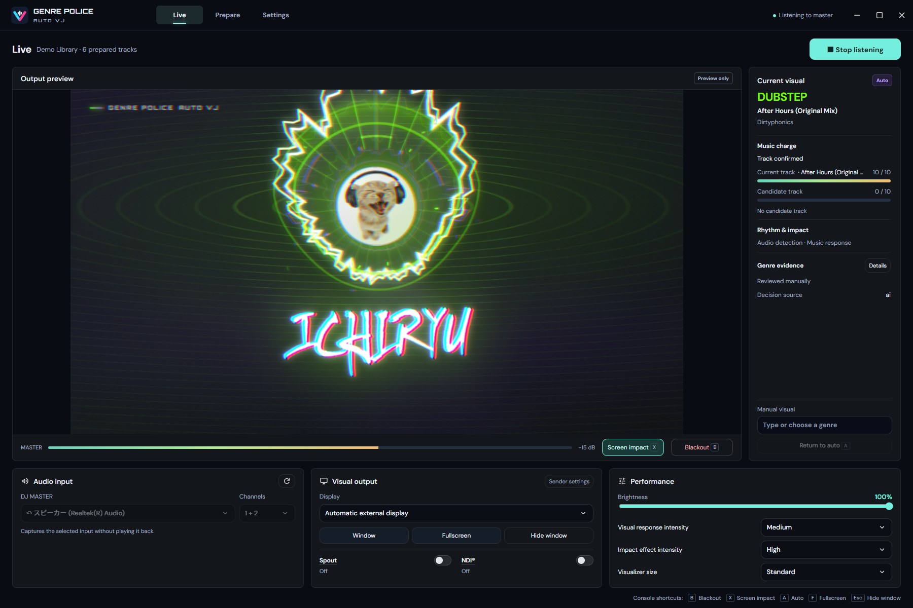
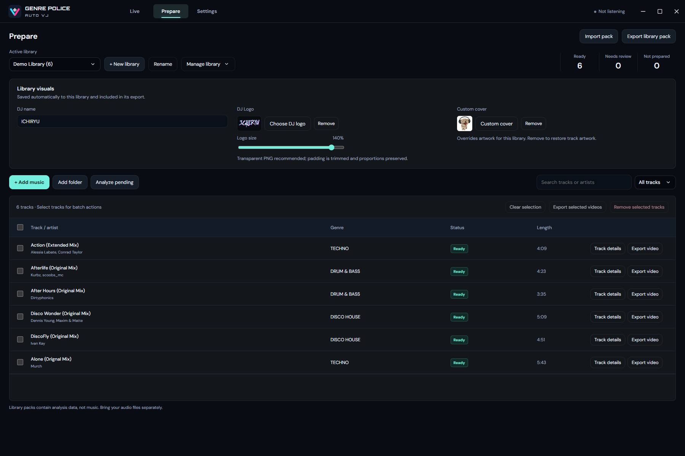

<h1 align="center">Genre Police AutoVJ</h1>

<p align="center">An automatic genre-aware visual tool for live DJ shows</p>

<p align="center">
  <a href="README.md">简体中文</a> · English · <a href="README.ja.md">日本語</a>
</p>

Genre Police AutoVJ is an automatic VJ tool for live DJ shows. It analyses a local library before the show, listens to the DJ Master / Record audio input during the set, identifies the current track, and drives the genre-aware visuals of [Genre Police Visualizer](https://github.com/lbnandy/genre-police-visualizer). It combines audio recognition from [VJVision](https://github.com/ichiryu0021/VJVision) with the Genre Police visual system for pre-show preparation and live output.

**Project design, visuals and genre-analysis integration by [LBN](https://github.com/lbnandy) · [Genre Police Visualizer](https://github.com/lbnandy/genre-police-visualizer); audio recognition by [DJ ICHIRYU](https://github.com/ichiryu0021) · [VJVision](https://github.com/ichiryu0021/VJVision)**

The current release is the `0.1.2` Beta functional test build for Windows 10/11 x64.

⭐ If you like this project, consider giving it a star on GitHub.

## Download

**[Open Releases to download the Windows portable build](../../releases)**

- Requires 64-bit Windows 10 or Windows 11 (x64).
- Download and run `Genre-Police-AutoVJ-0.1.2-portable.exe`; no installation is required.
- Node.js, Python and a separate AI runtime are not required.
- The package includes `BUILD-INFO.json` and `SHA256SUMS.txt`; use the latter if you want to verify the executable.

Version `0.1.2` is not Authenticode-signed. Windows SmartScreen may therefore show an unknown-publisher warning. Only download the executable from this project's GitHub Releases page.

## Screenshots

### Live show

<p align="center">
  <a href="docs/screenshots/autovj-live-stacked-en.png"></a>
</p>

### Library preparation

<p align="center">
  <a href="docs/screenshots/autovj-prepare-library-en.png"></a>
</p>

## Features

- **Pre-show analysis:** reads ID3, Vorbis and related tags, then combines Apple / Deezer lookup with whole-track local AI. Resolution priority is manual choices, file tags, online metadata and whole-track AI.
- **Live recognition:** uses [VJVision](https://github.com/ichiryu0021/VJVision) for fingerprint matching, music-charge evidence and candidate confirmation before a visual change.
- **Genre Police visuals:** keeps the [Genre Police Visualizer](https://github.com/lbnandy/genre-police-visualizer) visual structure, background design, typography, colour, motion and transitions, along with the track title, artist and artwork; lyrics are omitted from VJ output.
- **Beats and impact:** local beat tracking, Ableton Link synchronization, music-responsive or beat-driven impacts, adjustable impact strength, and screen-impact effects.
- **Show controls:** stacked or split layouts, element visibility, condensed English type, visual size, and standby visuals; each library can store a DJ name, logo, and custom artwork.
- **Library and output:** portable library import/export, library rename, full-library deletion, batch removal and undo; local preview, fullscreen display, Spout and NDI output.
- **Video export:** render local tracks to MP4 with clip previews, batch export, separate visual settings, and three video quality levels.
- **Performance and interface:** low-load mode, frame-rate caps, adaptive render quality, update reminders, output diagnostics, a frameless console, and Simplified Chinese, English, Japanese and Korean UI languages. Follow System is the default.

## Supported scope

AutoVJ listens to the selected DJ Master / Record audio input. It is not a music player and does not depend on Windows media sessions. Preparation supports MP3, FLAC, PCM WAV, AAC / M4A and PCM AIFF / AIFC; live output supports a local window, fullscreen external display, Spout and NDI. Test the audio device, graphics card, display or projector, and NDI receiver together before a show.

Local audio can also be rendered offline to MP4 without a live input.

## Usage

1. Run the portable build and open **Prepare**.
2. Create or import a library, add local music, run analysis and review uncertain results. Add one DJ name to the library if desired.
3. Export the prepared library as a portable pack and take it to the show computer; the pack does not contain the original audio.
4. Import the library on the show computer, select the DJ Master / Record input and channel pair, and start listening.
5. Choose window preview, fullscreen, Spout or NDI under video output; start fullscreen when using an external display. `Esc` hides output, `B` toggles blackout, `A` restores automatic visuals, `F` toggles fullscreen, and `X` toggles screen impact.

To export video, click **Export video** beside a track in **Prepare**, or select several tracks and choose **Export selected videos**. Set the picture and visual effects, optionally preview a clip, then export. Keep the original audio files available or relink them first.

## Privacy and network

- Audio from the selected DJ Master / Record input stays local for fingerprint matching, Music Battery evidence, spectrum and rhythm response; it is never uploaded.
- Video export reads source audio locally and saves an MP4 with audio to your chosen location; clip previews use local temporary files. Nothing is uploaded automatically.
- The application has no ads, telemetry, account system or automatic crash uploader.
- Online genre lookup can be disabled; when enabled, only matching metadata such as title, artist, album and duration is sent to the Apple Music catalog and Deezer. Audio is never sent, and mainland China networks use Apple China first and skip Deezer.
- Update checks access only this project's public GitHub Releases list and send no library, track or audio data; diagnostics are written locally only when the user explicitly exports them.

See the full [privacy statement](docs/PRIVACY.md).

## Current limitations

- Windows 10/11 x64 only; the portable build is not code-signed.
- Recognition depends on the selected DJ Master / Record audio input and channel pair; device, driver or mixer-routing problems can prevent recognition.
- Catalog metadata and local AI can return incomplete or uncertain genres. Remixes, compilations and cross-genre tracks may still need manual review.
- Spout / NDI compatibility depends on the graphics card, driver, receiver and network; test frame rate with the venue's high-resolution, multi-display or HDR setup.
- Video export requires the original audio; a library pack does not replace it. High resolutions and complex effects can make export slower than real time. Live recording is not supported.
- This is still a Beta release. MIDI / OSC, virtual-camera output, SRT, RTMP, SMPTE ST 2110 and automatic library merging are outside this release.

See [Known issues](docs/KNOWN_ISSUES.md) for more detail.

## Documentation

- [Architecture](docs/ARCHITECTURE.md)
- [Video output](docs/VIDEO-OUTPUT.zh-CN.md) (Chinese)
- [Privacy](docs/PRIVACY.md) (Chinese and English)
- [Known issues](docs/KNOWN_ISSUES.md)
- [Changelog](CHANGELOG.md)
- [Third-party notices and licences](THIRD_PARTY_NOTICES.md)
- [Security policy](SECURITY.md)

## From source

Development requirements: Windows 10/11 x64, Node.js 22.12 or newer, and the Visual Studio 2022 C++ tools with CMake.

```powershell
npm ci
npm run build:native
npm start
```

Run tests or build the Windows portable package:

```powershell
npm test
npm run dist
```

The default data directory is `%APPDATA%/Genre Police AutoVJ`; set `AUTOVJ_DATA_DIR` for an isolated development library. Read-only upstream copies are under `vendor`, with integration code in `renderer`, `packages` and `app`.

## Feedback and licences

Use [Issues](../../issues) for bugs and suggestions. Include the version, Windows version and reproduction steps; you may attach an exported diagnostics report, but do not publish original audio, private library data or credentials.

The application code is released under the [MIT License](LICENSE). Upstream projects, third-party fonts, runtimes, models and video-output components retain their respective licences; see [THIRD_PARTY_NOTICES.md](THIRD_PARTY_NOTICES.md). The Discogs-EffNet model has a separate non-commercial licence.
