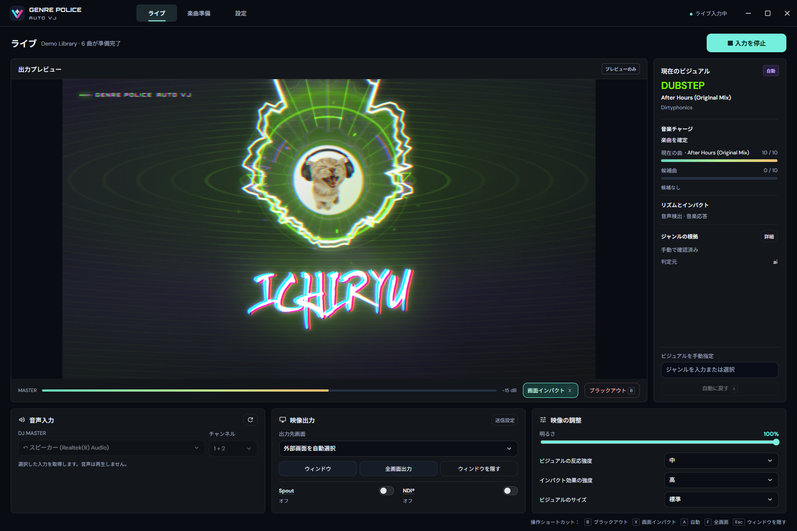
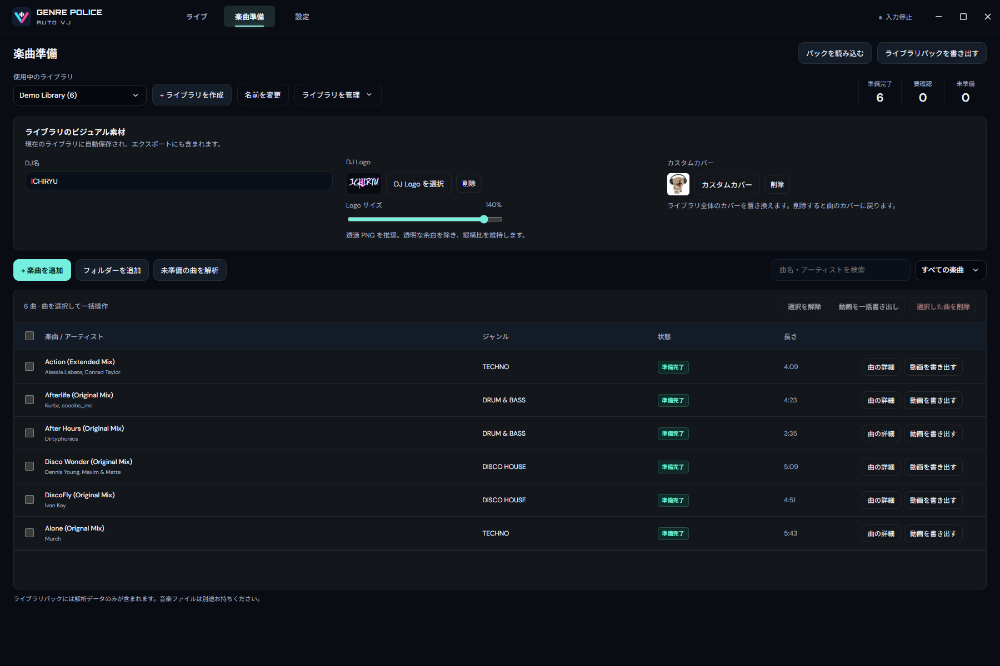

<h1 align="center">Genre Police AutoVJ</h1>

<p align="center">DJ のライブ現場向け自動ジャンル・ビジュアルツール</p>

<p align="center">
  <a href="README.md">简体中文</a> · <a href="README.en.md">English</a> · 日本語
</p>

Genre Police AutoVJ は DJ のライブ現場向け自動 VJ ツールです。本番前にローカルライブラリを分析し、現場では DJ Master / Record の音声入力を聴いて現在の曲を認識し、[Genre Police Visualizer](https://github.com/lbnandy/genre-police-visualizer) のジャンルビジュアルを動かします。[VJVision](https://github.com/ichiryu0021/VJVision) の音声認識と Genre Police のビジュアルシステムを組み合わせ、本番前の準備とライブ出力に対応します。

**プロジェクト設計・ビジュアル・ジャンル分析連携：[LBN](https://github.com/lbnandy) · [Genre Police Visualizer](https://github.com/lbnandy/genre-police-visualizer)；音声認識：[DJ ICHIRYU](https://github.com/ichiryu0021) · [VJVision](https://github.com/ichiryu0021/VJVision)**

現在は `0.1.2` Beta 機能テスト版で、Windows 10/11 x64 向けです。

⭐ 気に入っていただけたら、GitHub で Star を付けていただけるとうれしいです。

## ダウンロード

**[Releases から Windows ポータブル版をダウンロード](../../releases)**

- 対応環境：Windows 10 または Windows 11、64 ビット（x64）。
- `Genre-Police-AutoVJ-0.1.2-portable.exe` をダウンロードして、そのまま実行できます。インストールは不要です。
- Node.js、Python、追加の AI 実行環境は必要ありません。
- `BUILD-INFO.json` と `SHA256SUMS.txt` を同梱します。必要に応じて後者で実行ファイルを検証してください。

`0.1.2` は Authenticode によるコード署名を行っていません。そのため Windows SmartScreen に「不明な発行元」と表示される場合があります。実行ファイルは、このプロジェクトの GitHub Releases からのみダウンロードしてください。

## スクリーンショット

### ライブ画面

<p align="center">
  <a href="docs/screenshots/autovj-live-stacked-ja.png"></a>
</p>

### 準備音楽

<p align="center">
  <a href="docs/screenshots/autovj-prepare-library-ja.png"></a>
</p>

## 主な機能

- **事前ライブラリ分析**：ID3、Vorbis などのタグ、Apple / Deezer 検索、曲全体のローカル AI を組み合わせます。判定の優先順位は手動指定、ファイルタグ、オンライン情報、曲全体の AI です。
- **ライブ認識**：[VJVision](https://github.com/ichiryu0021/VJVision) で指紋照合、音楽電量の証拠蓄積、候補確認を行ってからビジュアルを切り替えます。
- **Genre Police ビジュアル**：[Genre Police Visualizer](https://github.com/lbnandy/genre-police-visualizer) のビジュアル構成、背景、書体、配色、動き、トランジションを引き継ぎ、曲名、アーティスト、アートワークを表示します。歌詞は VJ 出力に表示しません。
- **拍とインパクト**：ローカル拍認識、Ableton Link 同期、音楽応答 / 拍駆動、インパクト強度調整、画面インパクトに対応します。
- **ライブ設定**：上下 / 左右レイアウト、各要素の表示、英字ナロー体、ビジュアルのサイズ、待機ビジュアルを設定でき、ライブラリごとに DJ 名・ロゴ・カスタムアートワークを保存できます。
- **ライブラリと出力**：ポータブルなライブラリのインポート / エクスポート、ライブラリ名変更、全体削除、複数曲削除、取り消しに対応し、ウィンドウ、全画面、Spout、NDI へ出力できます。
- **動画の書き出し**：ローカルの楽曲を MP4 に変換できます。短いプレビュー、複数曲の一括書き出し、独立したビジュアル設定、3段階の動画品質に対応します。
- **性能と UI**：低負荷モード、FPS 上限、自動レンダー品質、更新通知、出力診断、フレームレスコンソール、中英日韓 UI に対応し、初期値はシステム言語に追従します。

## 対応範囲

AutoVJ は選択した DJ Master / Record の音声入力を聴くツールで、音楽を再生せず、Windows のメディアセッションにも依存しません。準備は MP3、FLAC、PCM WAV、AAC / M4A、PCM AIFF / AIFC、ライブ出力はウィンドウ、外部ディスプレイ全画面、Spout、NDI に対応します。本番前にオーディオ機器、グラフィックスカード、ディスプレイまたはプロジェクター、NDI レシーバーをまとめて確認してください。

ライブ入力を使わず、ローカル音源から MP4 動画をオフラインで書き出すこともできます。

## 使用方法

1. ポータブル版を実行して **楽曲準備** を開きます。
2. ライブラリを作成または読み込み、音源を追加して分析します。必要なら DJ 名を 1 つ設定します。
3. 準備したライブラリをポータブルパックとしてエクスポートし、本番 PC へ持っていきます。パックに元の音声ファイルは含まれません。
4. 本番 PC でライブラリをインポートし、DJ Master / Record 入力とチャンネルを選んでリスニングを開始します。
5. 映像出力でウィンドウ、全画面、Spout、NDI を選びます。外部ディスプレイを使う場合は全画面出力を開始します。`Esc` で出力を隠し、`B` はブラックアウト、`A` は自動ビジュアル、`F` は全画面、`X` は画面インパクトの切り替えです。

動画を書き出すには、「楽曲準備」で曲の横にある「動画を書き出す」をクリックするか、複数の曲を選択して「動画を一括書き出し」を選びます。画面とビジュアル効果を設定し、必要に応じて短いプレビューを確認してから書き出します。元の音声ファイルを保持するか、先に再関連付けしてください。

## プライバシーと通信

- 選択した DJ Master / Record の音声は、指紋照合、Music Battery の証拠、スペクトラム / リズム応答のために端末内だけで処理し、アップロードしません。
- 動画の書き出しでは元の音声を端末内で読み込み、音声付き MP4 を指定した場所に保存します。短いプレビューにはローカルの一時ファイルを使い、自動アップロードは行いません。
- 広告、テレメトリー、アカウントシステム、自動クラッシュアップローダーはありません。
- オンライン曲風検索は無効にできます。有効時も Apple Music カタログと Deezer へ送るのは曲名、アーティスト、アルバム、長さなどの照合用メタデータだけで、音声は送信しません。中国本土では Apple 中国を優先して Deezer をスキップします。
- 更新チェックは本プロジェクトの公開 GitHub Releases のみにアクセスし、ライブラリ、曲目、音声は送信しません。診断情報はユーザーが明示的にエクスポートした場合だけ本機に保存します。

詳細は [プライバシー](docs/PRIVACY.md) を参照してください。

## 現在の制限

- Windows 10/11 x64 のみ対応し、ポータブル版にコード署名はありません。
- 認識は選択した DJ Master / Record の音声入力とチャンネルに依存します。機器、ドライバー、ミキサー経路の問題によって認識できない場合があります。
- オンライン情報とローカル AI の曲風結果は不完全または不確かな場合があります。リミックス、コンピレーション、複数ジャンルの曲は手動確認が必要になることがあります。
- Spout / NDI の互換性はグラフィックスカード、ドライバー、レシーバー、ネットワークに依存します。高解像度、マルチディスプレイ、HDR 環境でのフレームレートを本番前に確認してください。
- 動画の書き出しには元の音声ファイルが必要です。ライブラリパックだけでは書き出せません。高解像度や複雑な効果では実時間より長くかかる場合があります。ライブ録画には対応していません。
- まだ Beta 版です。MIDI / OSC、仮想カメラ、SRT、RTMP、SMPTE ST 2110、自動ライブラリ統合は対象外です。

詳しくは [既知の問題](docs/KNOWN_ISSUES.md) を参照してください。

## ドキュメント

- [アーキテクチャ](docs/ARCHITECTURE.md)
- [映像出力](docs/VIDEO-OUTPUT.zh-CN.md)（中国語）
- [プライバシー](docs/PRIVACY.md)（中国語・英語）
- [既知の問題](docs/KNOWN_ISSUES.md)
- [変更履歴](CHANGELOG.md)
- [サードパーティーコンポーネントとライセンス](THIRD_PARTY_NOTICES.md)
- [セキュリティポリシー](SECURITY.md)

## ソースから実行

開発環境：Windows 10/11 x64、Node.js 22.12 以降、Visual Studio 2022 C++ ツール（CMake を含む）。

```powershell
npm ci
npm run build:native
npm start
```

テストの実行または Windows ポータブル版のビルド：

```powershell
npm test
npm run dist
```

既定のデータ保存先は `%APPDATA%/Genre Police AutoVJ` です。`AUTOVJ_DATA_DIR` で開発用ライブラリを分離できます。上流の読み取り専用コピーは `vendor`、連携コードは `renderer`、`packages`、`app` にあります。

## フィードバックとライセンス

不具合や改善案は共有リポジトリの [Issues](../../issues) に投稿してください。バージョン、Windows のバージョン、再現手順を添えてください。エクスポートした診断レポートは添付できますが、元の音声、個人ライブラリ、認証情報は公開しないでください。

本アプリケーションのコードは [MIT License](LICENSE) で公開しています。上流プロジェクト、サードパーティーのフォント、ランタイム、モデル、映像出力コンポーネントは各自のライセンスに従います。詳細は [THIRD_PARTY_NOTICES.md](THIRD_PARTY_NOTICES.md) を参照してください。Discogs-EffNet モデルには別の非商用ライセンスがあります。
