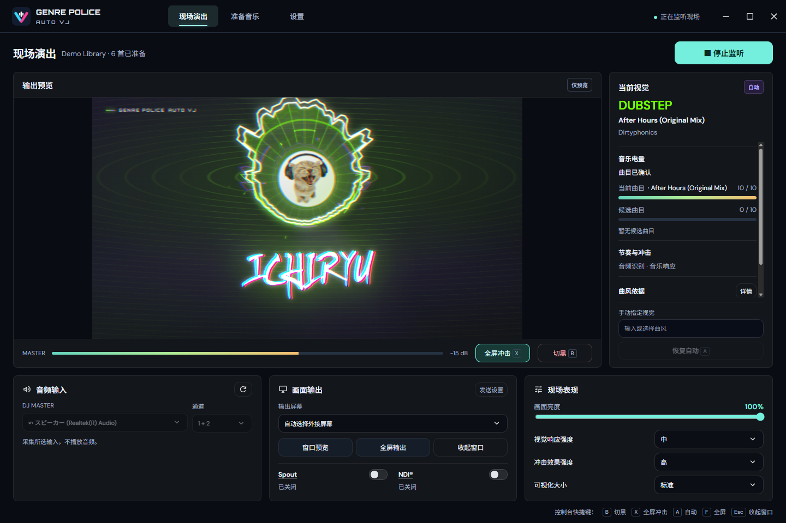
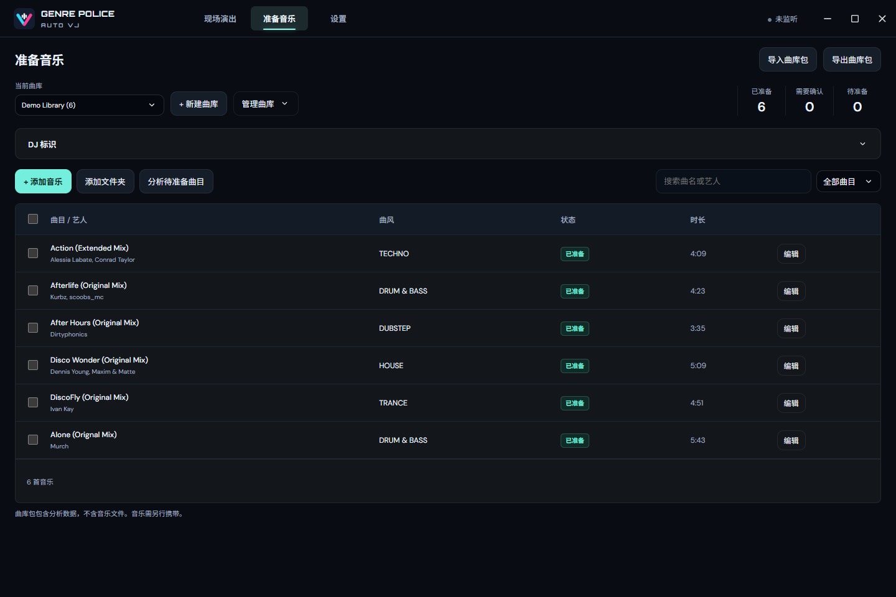

<h1 align="center">Genre Police AutoVJ</h1>

<p align="center">面向 DJ 现场演出的自动曲风视觉工具</p>

<p align="center">
  简体中文 · <a href="README.en.md">English</a> · <a href="README.ja.md">日本語</a>
</p>

Genre Police AutoVJ 是面向 DJ 现场演出的自动 VJ 工具：演出前分析本地曲库，现场监听 DJ Master / Record 音频输入并识别当前曲目，再驱动 [Genre Police Visualizer](https://github.com/lbnandy/genre-police-visualizer) 的曲风视觉。它将 [VJVision](https://github.com/ichiryu0021/VJVision) 的音频识别与 Genre Police Visualizer 的视觉系统结合起来，适合演出前准备和现场输出。

**项目设计、视觉与曲风分析整合：[LBN](https://github.com/lbnandy) · [Genre Police Visualizer](https://github.com/lbnandy/genre-police-visualizer)；音频识别：[DJ ICHIRYU](https://github.com/ichiryu0021) · [VJVision](https://github.com/ichiryu0021/VJVision)**

当前为 `0.1.1` Beta 功能测试版，面向 Windows 10/11 x64。

⭐ 如果你喜欢这个项目，欢迎点个 Star 支持一下。

## 下载

**[前往 Releases 下载 Windows 便携版](../../releases)**

- 系统要求：Windows 10 或 Windows 11，64 位（x64）。
- 下载 `Genre-Police-AutoVJ-0.1.1-portable.exe` 后直接运行，无需安装。
- 不需要另外安装 Node.js、Python 或单独的 AI 环境。
- 发布包同时提供 `BUILD-INFO.json` 和 `SHA256SUMS.txt`，可使用后者核对文件校验值。

`0.1.1` 尚未进行 Authenticode 代码签名，因此 Windows SmartScreen 可能显示“无法识别的发布者”。请只从本项目的 GitHub Releases 页面下载。

## 界面预览

### 现场演出

<p align="center">
  <a href="docs/screenshots/autovj-live-stacked-zh.png"></a>
</p>

### 准备音乐

<p align="center">
  <a href="docs/screenshots/autovj-prepare-library-zh.png"></a>
</p>

## 主要功能

- **前置曲库分析**：读取 ID3、Vorbis 等标签，结合 Apple / Deezer 查询和整曲本地 AI；结果优先级为手动指定、文件标签、在线资料、整曲 AI。
- **现场识别**：使用 [VJVision](https://github.com/ichiryu0021/VJVision) 进行指纹匹配、音乐电量证据累积和候选确认，确认后再切换视觉。
- **Genre Police 视觉**：沿用 [Genre Police Visualizer](https://github.com/lbnandy/genre-police-visualizer) 的可视化结构、背景设计、字体、配色、动态效果和过渡，并保留曲名、艺人和封面；VJ 输出不显示歌词。
- **节拍与冲击**：支持 本地节拍识别、Ableton Link 同步、音乐响应 / 节拍驱动、冲击强度调节和全屏冲击。
- **现场设置**：支持上下 / 左右布局、元素显示开关、英文窄体、可视化大小和待机视觉；每套曲库可保存 DJ 名字、Logo 和自定义封面。
- **曲库与输出**：支持曲库导入/导出、重命名、整库删除、批量移除和撤销；输出到窗口预览、全屏外接屏幕、Spout 或 NDI。
- **性能与界面**：支持低负载模式、帧率上限、自适应渲染质量、更新提示与输出诊断、无边框控制台和中英日韩界面，默认跟随系统语言。

## 支持范围

AutoVJ 监听用户选择的 DJ Master / Record 音频输入，不播放音乐，也不依赖 Windows 系统媒体会话。准备阶段支持 MP3、FLAC、PCM WAV、AAC / M4A 和 PCM AIFF / AIFC；现场输出支持窗口预览、全屏外接屏幕、Spout 和 NDI。演出前应联调使用的声卡、显卡、显示或投影设备以及 NDI 接收端。

## 使用方法

1. 运行便携版，打开「准备音乐」并创建或导入曲库。
2. 添加本地音乐，运行分析，复核需要确认的结果；可为整套曲库填写 DJ 名字。
3. 将准备好的曲库导出为便携曲库包，带到演出电脑；曲库包不包含原始音频。
4. 在演出电脑导入曲库，选择 DJ Master / Record 输入与通道，开始监听。
5. 在画面输出中选择窗口预览、全屏、Spout 或 NDI；需要外接屏幕时启动全屏输出。`Esc` 收起输出，`B` 切黑，`A` 恢复自动，`F` 切换全屏，`X` 切换全屏冲击。

## 隐私与联网

- 选定的 DJ Master / Record 音频只在本机用于指纹匹配、音乐电量、频谱/节奏响应和整曲本地 AI 分析，不会上传。
- 软件不包含广告、遥测、账号系统或自动崩溃上传。
- 在线曲风查询可以关闭；开启时只向 Apple Music 目录和 Deezer 发送曲名、艺人、专辑、时长等匹配所需的元数据，不发送音频。中国大陆网络优先 Apple 中国并跳过 Deezer。
- 更新检查只访问本项目公开的 GitHub Releases，不发送曲库、曲目或音频；诊断报告仅在用户主动导出时写入本地。

完整说明见 [隐私说明](docs/PRIVACY.md)。

## 当前限制

- 目前只提供 Windows 10/11 x64 版本，便携版尚未进行代码签名。
- AutoVJ 依赖选定的 DJ Master / Record 音频输入和正确通道；设备、驱动或混音路由异常时可能无法识别。
- 在线资料和本地 AI 都可能返回不完整或不确定的曲风结果，混音、合辑和跨曲风曲目仍需人工复核。
- Spout / NDI 的兼容性取决于显卡、驱动、接收端和网络；高分辨率、多显示器或 HDR 环境下的帧率仍需现场测试。
- 当前仍为 Beta；MIDI / OSC、录像、虚拟摄像头、SRT、RTMP、SMPTE ST 2110 和自动合并曲库不在本版本范围内。

更多内容见 [已知问题](docs/KNOWN_ISSUES.md)。

## 文档

- [架构说明](docs/ARCHITECTURE.md)
- [视频输出说明](docs/VIDEO-OUTPUT.zh-CN.md)
- [隐私说明](docs/PRIVACY.md)
- [已知问题](docs/KNOWN_ISSUES.md)
- [变更记录](CHANGELOG.md)
- [第三方组件与许可证](THIRD_PARTY_NOTICES.md)
- [安全政策](SECURITY.md)

## 从源码运行

开发环境要求：Windows 10/11 x64、Node.js 22.12 或更高版本、Visual Studio 2022 C++ 工具（含 CMake）。

```powershell
npm ci
npm run build:native
npm start
```

运行测试或生成 Windows 便携版：

```powershell
npm test
npm run dist
```

默认数据目录为 `%APPDATA%/Genre Police AutoVJ`；`AUTOVJ_DATA_DIR` 可用于隔离开发曲库。上游只读副本位于 `vendor`，整合代码位于 `renderer`、`packages` 和 `app`，便于审核后同步视觉更新。

## 反馈与许可

问题和建议可以在共享仓库的 [Issues](../../issues) 中提交，请附上版本号、Windows 版本和复现步骤；可附软件导出的诊断报告，但不要公开原始音频、私人曲库或任何凭据。

本项目代码采用 [MIT License](LICENSE)。上游项目、第三方字体、运行库、模型和视频输出组件适用各自许可证，详情见 [THIRD_PARTY_NOTICES.md](THIRD_PARTY_NOTICES.md)。Discogs-EffNet 模型使用独立的非商业许可。
